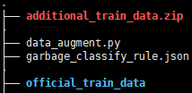
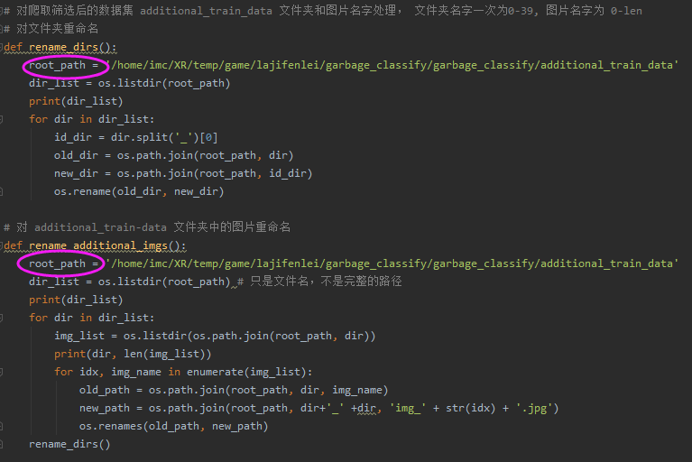
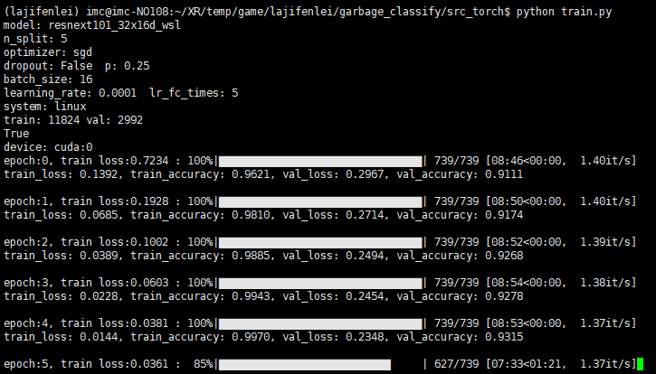
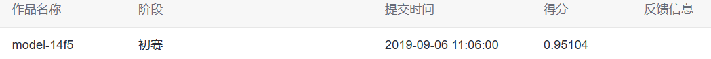

# project4--Garbage-sorting
 **Huawei cloud artificial intelligence competition** **·** **Garbage sorting challenge cup**

**✧** **（****The number of participants is 2,611***）           

**✧**  our **ranking**：**32**， **score**：**0.95104**

**Description:** The task of the competition is to classify garbage pictures, that is, first identify the categories of items in garbage pictures (such as cans, peel, etc.), then query the garbage classification rules, output the items in the garbage pictures belong to recyclables, kitchen waste, harmful garbage and other garbage

Ÿ   In addition to the 542M data set on the official website, we used the crawler technology to crawl 666M images online

Ÿ   Enhancement of datasets

Ÿ   My classmates and I tried many Backbone, like ResNet, SENet 

Ÿ   Some training tricks were used. Also, multimodel fusion

------

## **Introduction**

under the **garbage_classify** folder：



- *data_augment.py*---------datasets augmentation

- *garbage_classify_rule.json*--------training set label file

- *official_train_data*-------The official training set

- *additional_train_data.zip*---------Images crawled with python crawlers，Because the number of pictures provided by the official website is not enough

------

## Follow these steps：

1. under the **src_torch/utils** directory：

```
python img_dataset_process.py
```

note：

Change these two paths twice：the path of *official_train_data* and the path of *additional_train_data*，

and then both of these paths have to run twice



2. under the **src_torch** directory：

```
python train.py
```



3. under the **src_torch** directory：

   ```
   python test.py
   ```

   ------

   In this competition，our score：0.95104，ranking：32

